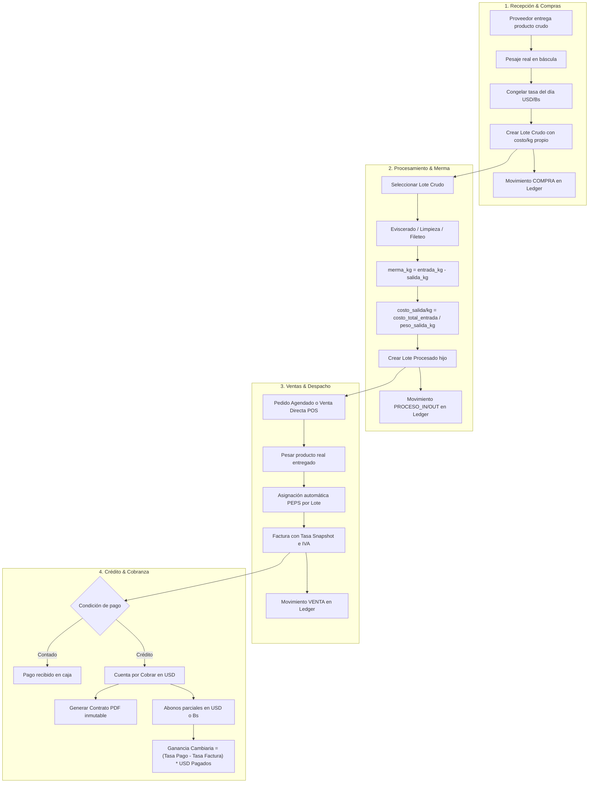
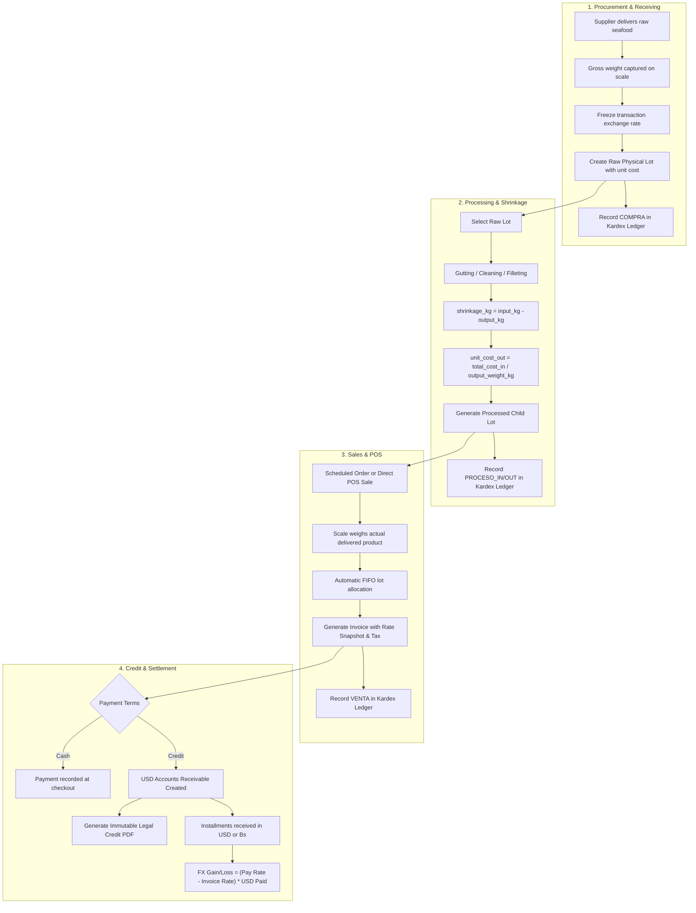

# Pescadería MVP — Sistema de Gestión / ERP Management System (Altamar Sea Food)

<p align="center">
  <a href="#-español"><b>🇪🇸 Versión en Español</b></a> | 
  <a href="#-english"><b>🇬🇧 English Version</b></a>
</p>

---

# 🇪🇸 Español

## 1. Visión General del Proyecto

**Altamar Sea Food** es un sistema interno tipo ERP diseñado específicamente para una pescadería y comercializadora de productos marinos en Venezuela. El sistema cubre de extremo a extremo el ciclo de vida del producto perecedero:

$$\text{Comprar} \longrightarrow \text{Pesar} \longrightarrow \text{Procesar / Limpiar (Merma)} \longrightarrow \text{Re-pesar} \longrightarrow \text{Vender por peso} \longrightarrow \text{Cobrar / Liquidar}$$

El sistema está modelado para resolver de forma nativa la **complejidad cambiaria y económica venezolana**:
* Manejo de dos monedas operativas: **USD como moneda base y de registro contable estable**, y **Bolívares (Bs) como moneda transaccional del día a día**.
* Captura y seguimiento de la tasa oficial del **Banco Central de Venezuela (BCV)** (USD y EUR) y de la **tasa paralela**, con congelamiento de tasa en cada transacción (*rate snapshotting*).
* Venta a crédito y contado con cálculo y contabilización en tiempo real de la **ganancia o pérdida cambiaria en Bs** generada entre la fecha de emisión y las fechas de cobro/abono.
* Control estricto de **merma en procesamiento**: la pérdida de masa en eviscerado/fileteado encarece el costo unitario del producto resultante.
* Trazabilidad y costeo de inventario por **lote físico individual** y asignación en ventas bajo el principio **PEPS (Primeras Entradas, Primeras Salidas / FIFO)**.

---

## 2. Stack Tecnológico

| Capa / Dominio | Tecnología | Versión | Propósito y Justificación Técnica |
|---|---|---|---|
| **Framework Fullstack** | [Next.js](https://nextjs.org/) | `16.3.7` (App Router) | Renderizado del lado del servidor (React Server Components), Server Actions y Route Handlers optimizados. Permite SSR para seguridad y rendimiento sin exponer datos sensibles al cliente. |
| **Biblioteca de UI** | [React](https://react.dev/) | `19.2.8` | Interfaz reactiva moderna basada en hooks y Server Components concurrentes. |
| **Lenguaje** | [TypeScript](https://www.typescriptlang.org/) | `^5` | Tipado estático estricto en todo el dominio (`src/types/domain.ts`), minimizando errores en tiempo de ejecución. Regla de proyecto: cero `any` injustificados. |
| **Componentes de UI** | [Material UI (MUI)](https://mui.com/) | `v9.4.0` | Componentes complejos y densos en datos: `@mui/x-data-grid` (tablas paginadas y ordenables), `@mui/x-date-pickers` (fechas valor), Autocomplete y Diálogos accesibles. |
| **Diseño y Estilos** | [Tailwind CSS](https://tailwindcss.com/) | `v4` | Manejo exclusivo de layout, grillas (`grid`), flexbox y espaciado responsivo. *Nota técnica*: el `preflight` está desactivado y no se utilizan clases de color de Tailwind para no colisionar con el motor de temas de MUI. |
| **Backend & Base de Datos** | [Supabase](https://supabase.com/) | Postgres `15+` | Base de datos relacional con integridad referencial, autenticación segura (Supabase Auth), Row-Level Security (RLS) por roles y almacenamiento de archivos (Storage). |
| **Conectores Supabase** | `@supabase/ssr` / `@supabase/supabase-js` | `^0.12.7` / `^2.117.2` | Manejo de cookies de sesión seguro en middleware y cliente/servidor. |
| **Formularios & Validación** | `react-hook-form` + `zod` | `^7.89.0` / `^4.6.5` | Validación de formularios tipo-segura en cliente y servidor con esquemas centralizados en `src/lib/*Validation.ts`. |
| **Motor de Tasas Cambiarias** | Web Scraper (`undici`) + [DolarAPI](https://dolarapi.com/) | `undici ^8.11.2` | Extracción automatizada de tasas BCV (USD/EUR) mediante scraping con fallback a DolarAPI y ejecución programada vía Vercel Cron. |
| **Generación de Documentos** | [@react-pdf/renderer](https://react-pdf.org/) | `^4.9.0` | Generación de contratos y acuerdos de crédito en PDF legalmente inmutables, almacenados en buckets privados de Supabase. |
| **Servicio de Correo** | [Resend](https://resend.com/) | API REST | Notificaciones automáticas de cobranza y recordatorios de facturas por vencer/vencidas por email. |
| **Fechas & Formateo** | `dayjs` / `react-number-format` | `^1.11.23` / `^5.4.5` | Manipulación ligera de fechas y formateo consistente de montos en USD/Bs y kg con decimales tabulares. |

---

## 3. Arquitectura de Software

El sistema sigue una arquitectura por capas limpia orientada a principios **SOLID**, desacoplando totalmente la lógica de negocio de la capa de interfaz y de la infraestructura de persistencia.

```
┌────────────────────────────────────────────────────────────────────────┐
│  src/app/** (Páginas y Route Handlers)                                 │
│  - Server Components orquestadores y páginas de App Router             │
│  - Route Handlers (/api/cron/tasas, /api/contratos, etc.)              │
│  - Sin lógica de negocio directa: solo ensamblan vistas y delegan      │
├────────────────────────────────────────────────────────────────────────┤
│  src/components/** (Atomic Design)                                     │
│  - atoms/     : Botones, chips de estado, franjas náuticas, iconos     │
│  - molecules/ : Filtros, campos RIF/CI, tarjetas de resumen            │
│  - organisms/ : AppDataGrid, AppDialog, formularios modales, tablas    │
│  - templates/ : Estructuras de página y AppShell persistente           │
├────────────────────────────────────────────────────────────────────────┤
│  src/lib/services/** (Capa de Dominio y Lógica de Negocio - SRP)       │
│  - tasaService      : Resolución de tasas, scraping y persistencia     │
│  - costingService   : Transferencia de costos y valorización           │
│  - loteService      : Trazabilidad, costeo por lote y PEPS (FIFO)      │
│  - invoiceService   : Facturación, IVA desglosado y snapshots          │
│  - creditService    : Saldos de crédito y ganancia/pérdida cambiaria   │
│  - inventoryService : Ledger auditable de movimientos (kardex)         │
├────────────────────────────────────────────────────────────────────────┤
│  src/lib/repositories/** (Capa de Acceso a Datos - DIP)                │
│  - Interfaces abstractas (IXxxRepository) para desacoplamiento y tests │
│  - Implementaciones concretas (SupabaseXxxRepository)                  │
│  - Única capa autorizada para comunicarse con el cliente de Supabase   │
├────────────────────────────────────────────────────────────────────────┤
│  Supabase / PostgreSQL (Capa de Persistencia & Seguridad)              │
│  - Tablas relacionales con restricciones de integridad                 │
│  - Row-Level Security (RLS) estricto por rol (admin / operador)        │
│  - Vistas y funciones SQL seguras con SECURITY DEFINER cuando aplica   │
│  - Bucket privado 'contratos' para PDFs firmados                       │
└────────────────────────────────────────────────────────────────────────┘
```

### Patrones de Diseño Aplicados
1. **Repository Pattern con Dependency Inversion (DIP)**: Los servicios no invocan directamente las tablas de Supabase. Interactúan mediante interfaces (`IClienteRepository`, `ILoteRepository`, etc.), permitiendo pruebas unitarias con mocks o sustitución de proveedor de base de datos sin afectar la lógica de negocio.
2. **Strategy Pattern**: Aplicado en las condiciones de pago (`contado` vs `credito`), los canales de notificación (`whatsapp` vs `email`) y las estrategias de resolución de tasa cambiaria (`bcv_scraping`, `dolarapi`, `manual`).
3. **Factory Pattern**: Utilizado para la creación inmutable y consistente de registros en el ledger general de inventario (`movimientos`), garantizando que cada tipo de evento (`compra`, `proceso_in`, `proceso_out`, `venta`, `ajuste`, `perdida`) contenga la metadata contable requerida.
4. **Snapshot Immutability**: Cada transacción financiera y de inventario guarda copias congeladas de los datos en ese instante (tasa, costo unitario, IVA), evitando que modificaciones maestras futuras alteren estados financieros históricos.

---

## 4. Diseño del Sistema (System Design) y Flujos Críticos

### 4.1. Flujo Integral del Negocio



### 4.2. Detalle de los Flujos Principales

#### A. Ciclo de Tasas de Cambio
* **Cron Programado**: Un Vercel Cron (`/api/cron/tasas`) se ejecuta en dos horarios estratégicos (21:30 y 12:00 UTC-3) para capturar la publicación de la tasa BCV con fecha valor del día siguiente o actual.
* **Resiliencia**: El servicio intenta primero scraping directo contra `www.bcv.org.ve`. Si el portal de BCV está fuera de línea o bloquea la petición, conmuta inmediatamente a DolarAPI como fallback.
* **Seguridad de Escritura**: La tabla `tasas` solo puede ser modificada por usuarios con rol `admin` o por el backend mediante la clave segura `service_role`. Ningún usuario operador puede manipular el histórico de tasas.
* **Fecha Valor**: Al operar en una fecha determinada, el sistema busca la última tasa registrada con `fecha_valor <= fecha_operacion`.

#### B. Procesamiento y Absorción de Merma
En la industria pesquera, la merma (vísceras, cabeza, escamas, espinas) no es un desperdicio contable aislado, sino parte intrínseca del costo del producto terminado:
* Entrada: Lote crudo (ej: $100\text{ kg}$ a $\$4.00/\text{kg} = \$400.00$).
* Salida: Lote procesado limpio (ej: $60\text{ kg}$).
* Merma: $40\text{ kg}$ ($40\%$). Rendimiento: $60\%$.
* **Costo resultante**: El costo total de $\$400.00$ se traslada íntegramente a los $60\text{ kg}$ limpios:
  $$\text{Costo por kg limpio} = \frac{\$400.00}{60\text{ kg}} = \$6.666667/\text{kg}$$
* El stock del lote crudo disminuye a 0 (o la fracción usada) y se origina un nuevo lote procesado con su costo unitario exacto.

#### C. Asignación de Inventario en Ventas: PEPS (FIFO)
* Al facturar un producto (sea crudo o procesado), el sistema consulta los lotes abiertos disponibles y sugiere consumir primero el lote más antiguo (por fecha de ingreso).
* Se llena la tabla intermedia `factura_item_lotes`, grabando el lote exacto de donde salió cada fracción de kilo vendida y el costo original de ese lote.
* **Cálculo de COGS (Costo de Mercancía Vendida) y Margen Real**: Permite determinar el margen comercial neto tanto en USD como en Bs por cada producto, venta y lote específico.

#### D. Liquidación de Créditos y Ganancia Cambiaria
* La obligación financiera se fija y congela contractualmente en **USD**.
* Si el cliente paga en Bolívares (Pago Móvil, Transferencia, Efectivo Bs), se toma la **tasa del día del abono**:
  $$\text{Ganancia Cambiaria (Bs)} = (\text{Tasa}_{\text{pago}} - \text{Tasa}_{\text{factura}}) \times \text{Monto}_{\text{USD pagado}}$$
* Si la tasa subió (devaluación del bolívar), la empresa obtiene una ganancia cambiaria en bolívares para cubrir el costo de reposición de divisas. Si la tasa bajó, se registra la correspondiente pérdida cambiaria.

---

## 5. Decisiones Técnicas y Matriz de Trade-offs

| Decisión Arquitectónica | Qué se eligió | Alternativas consideradas | Justificación y Trade-off Aceptado |
|---|---|---|---|
| **Moneda Base Contable** | **USD** como referente estable de valor; Bs como moneda operativa. | Moneda base en Bolívares (Bs). | **Trade-off:** Obliga a mostrar importes bimonetarios en prácticamente todas las pantallas y formularios. **Beneficio:** Blindaje de los estados financieros e inventarios frente a la hiperinflación y fluctuaciones cambiarias severas en Venezuela. |
| **Fuente de Tasas de Cambio** | **Scraping directo a BCV** con fallback a **DolarAPI** + fijación manual. | Suscripción a APIs cambiarias de pago o ingreso 100% manual. | **Trade-off:** El scraping de HTML puede romperse si BCV modifica su maquetación. Se mitigó con detección de fallos, fallback a DolarAPI y alertas automáticas, logrando cero costo operativo mensual y alineación exacta con la tasa legal. |
| **Inmutabilidad de Tasas (*Rate Snapshot*)** | Cada transacción graba permanentemente la tasa vigente al momento de su creación. | Recalcular importes al vuelo consultando la tabla `tasas`. | **Trade-off:** Se requieren columnas redundantes en tablas de compras, facturas y pagos. **Beneficio:** Trazabilidad inalterable y auditoría contable fidedigna; una corrección en el historial de tasas jamás corrompe transacciones cerradas. |
| **Modelo de Costeo de Inventario** | **Por Lote Físico + PEPS** en ventas. | Promedio Ponderado Móvil (WAC). | **Trade-off:** Mayor complejidad en la base de datos (`lotes`, `factura_item_lotes`, `movimientos`). **Beneficio:** Exactitud total del margen bruto en perecederos donde compras de días sucesivos tienen costos y rendimientos muy dispares. |
| **Tratamiento de la Merma** | **Transferencia del 100% del costo** al producto limpio resultante. | Registrar la merma como gasto o pérdida operativa inmediata. | **Trade-off:** No permite mezclar lotes de entrada en un mismo proceso (relación 1 a 1 de lote crudo a lote procesado). **Beneficio:** Refleja con precisión matemática el costo real de reposición del kilogramo de producto limpio. |
| **Alcance de Facturación** | **Facturación y gestión interna** con IVA configurable (16%). | Integración con impresoras fiscales SENIAT y facturación electrónica. | **Trade-off:** La emisión fiscal legal se tramita fuera del sistema en la etapa actual. **Beneficio:** Despliegue veloz del MVP centrado en el control operativo del negocio sin depender de hardware fiscal propietario. |
| **Contratos de Crédito Legales** | **PDF inmutable generado en servidor** y guardado en bucket privado de Supabase. | Vistas web dinámicas renderizadas bajo demanda. | **Trade-off:** Mayor consumo de almacenamiento en Supabase y proceso asíncrono de renderizado PDF. **Beneficio:** Inmutabilidad legal total; el documento PDF es idéntico al firmado físicamente por el cliente/proveedor. |
| **Coexistencia de Estilos UI** | **MUI v9** para componentes complejos + **Tailwind v4** solo para layout. | Tailwind UI puro o Material UI puro. | **Trade-off:** Dos dependencias de estilos en el proyecto. **Beneficio:** Evita reinventar tablas interactivas complejas (DataGrid), pickers de fechas accesibles y autocompletes, mientras Tailwind ofrece agilidad extrema para flexbox y espaciado responsivo. |
| **Control de Acceso y Seguridad** | **Row-Level Security (RLS)** directo en PostgreSQL. | Filtros lógicos en endpoints de Node.js / API. | **Trade-off:** Complejidad en la escritura y mantenimiento de políticas SQL. **Beneficio:** Seguridad imposible de burlar desde el cliente: incluso con la clave pública de Supabase, un operador tiene vedado el acceso a costos, márgenes y balances. |

---

## 6. Identidad Visual "Peñero" y Estándares de UI/UX

El diseño del sistema sigue las directrices consolidadas en [`specs/00-estandares-ui`](specs/00-estandares-ui), inspiradas en la estética marinera del **peñero** (la embarcación de pesca artesanal tradicional venezolana):

### 6.1. Paleta de Colores
* **Azul Petróleo (`primary`)**: `#0E4A5C` (claro) / `#7CC3D6` (oscuro) — Representa el casco del peñero y el mar profundo; utilizado para botones principales, enlaces y selección.
* **Borda Roja (`secondary`)**: `#B8402E` (claro) / `#E58A74` (oscuro) — El borde superior de la lancha; acentos destacados y alertas críticas.
* **Franja Ocre (`brand.ochre`)**: `#E8B931` (claro) / `#D9A92A` (oscuro) — Detalle decorativo identitario. **Regla de oro**: solo se usa en franjas decorativas (`PeneroStripes`), nunca como fondo o color de texto.
* **Neutros Fríos (`background.default` / `paper`)**: `#F3F6F6` (hielo de cava) / `#0F2229` (cubierta nocturna).

### 6.2. Tipografía Dual
* **Barlow Condensed** (`--font-display`): Reservada para encabezados (`h4` a `h6`), totales de facturas y KPIs numéricos destacados. Otorga carácter rotulado de lancha pesquera sin saturar el ancho de pantalla.
* **Barlow** (`--font-body`): Textos de interfaz, formularios y tablas.
* **Cifras Tabulares (`tabular-nums`)**: Obligatorio en importes, pesos y tasas en tablas para garantizar alineación decimal exacta.

### 6.3. Sistema de 5 Niveles de Carga (Zero Blanks, Zero Generic Spinners)
Queda prohibido mostrar pantallas en blanco o spinners circulares genéricos en el centro de la pantalla:
1. **Nivel 1 (Global de Marca)**: `BrandLoader` a pantalla completa para login, logout o generación pesada de PDFs (aparece a los 150 ms para evitar parpadeos y permanece mínimo 400 ms).
2. **Nivel 2 (Navegación)**: `NavigationProgress` con la borda náutica animada en la barra superior al cambiar de ruta.
3. **Nivel 3 (Página Inicial)**: `PageLoader` con skeletons que imitan la estructura real de la pantalla (tabla, formulario o ficha).
4. **Nivel 4 (Refresco de Datos)**: `AppDataGrid` loading overlay manteniendo visibles las columnas.
5. **Nivel 5 (Acción en Botón)**: Botones con spinner interno y deshabilitado de seguridad mientras se procesa la acción.

---

## 7. Esquema de Base de Datos (Resumen)

El esquema relacional consta de aproximadamente 20 tablas en Postgres:

| Módulo / Tabla | Propósito y Contenido Principal |
|---|---|
| `tasas` | Registro histórico de tasas USD/EUR, valor en Bs, fuente (`bcv`, `paralela`, `manual`) y usuario/servicio de origen. |
| `productos` | Catálogo maestro de productos: código, tipo (`crudo` o `procesado`), categoría y bandera de control de stock. |
| `clientes` / `proveedores` | Directorio de clientes y proveedores con RIF/CI, contacto, límite/días de crédito y estado de bloqueo. |
| `representantes_legales` / `documentos_*` | Expediente KYC y antifraude para validación de crédito y firmas de contratos. |
| `compras` / `compra_items` | Recepción de mercancía cruda, costo/kg acordado, tasa congelada, pesaje de entrada y condición de pago. |
| `procesamientos` / `proceso_items` | Transformación de producto crudo a procesado, pesaje de entrada/salida, merma y costo transferido. |
| `lotes` / `perdidas_lote` | Registro físico individual de cada lote, trazabilidad origen-destino, stock remanente y mermas por descomposición/daño. |
| `pedidos` / `pedido_items` | Pedidos agendados de clientes con peso estimado versus peso real entregado en despacho. |
| `facturas` / `factura_items` | Documento de venta comercial: número correlativo, IVA configurable, totales en USD y Bs congelados. |
| `factura_item_lotes` | Vínculo relacional que desglosa de qué lotes físicos específicos (PEPS) se despachó cada ítem vendido. |
| `pagos` / `pagos_proveedores` | Abonos a facturas y compras a crédito, moneda de pago, tasa del día y cálculo de diferencial cambiario en Bs. |
| `movimientos` | Ledger general inmutable de inventario (Kardex auditable: entradas, salidas, procesos, ajustes, mermas). |
| `contratos` | Acuerdos de crédito bilaterales en PDF inmutable almacenados en Supabase Storage con control de estados. |
| `recordatorios_cobro` | Bitácora de gestión de cobranza por WhatsApp y correo electrónico (Resend). |
| `config_negocio` | Registro único (*singleton*) con configuración de IVA, días de crédito por defecto y datos fiscales de la empresa. |

---

## 8. Metodología de Desarrollo: Spec-Driven Development (SDD)

El repositorio se gestiona bajo el paradigma **Spec-Driven Development**:
* **`/SPEC.md`**: Es la única fuente de verdad global con las decisiones de negocio y técnicas cerradas.
* **`/specs/NN-modulo/`**: Cada módulo funcional posee su propia especificación (`spec.md`), lista de tareas atómicas secuenciales (`tasks.md`) y lista de verificación (`checklist.md`).
* **Subagentes de IA y Comandos**: 
  - `planner`: Diseña la solución y redacta las especificaciones.
  - `executor`: Implementa código siguiendo `tasks.md` en estricto orden.
  - `verifier`: Valida el cumplimiento del `checklist.md` y ejecuta análisis estático (`lint`, `tsc`).
* **Definition of Done (DoD)**: Una tarea o módulo solo se considera terminado cuando:
  1. `npm run lint` pasa sin advertencias ni errores.
  2. `npx tsc --noEmit` compila limpiamente sin errores de tipos.
  3. Todas las migraciones SQL incrementales se han ejecutado sin errores.
  4. Los ítems de `checklist.md` están verificados.

---

## 9. Instalación y Puesta en Marcha Local

### Prerrequisitos
* **Node.js**: `v20.x` o superior.
* **npm**: `v10.x` o superior.
* Un proyecto de **Supabase** activo (en la nube o local con Supabase CLI).

### Pasos de Configuración
```bash
# 1. Clonar el repositorio
git clone <url-del-repositorio>
cd pescaderia-mvp

# 2. Instalar dependencias
npm install

# 3. Configurar variables de entorno
cp .env.example .env.local
```

### Variables de Entorno (`.env.local`)
| Variable | Requerida | Propósito |
|---|---|---|
| `NEXT_PUBLIC_SUPABASE_URL` | Sí | URL del proyecto Supabase (acceso cliente y servidor). |
| `NEXT_PUBLIC_SUPABASE_ANON_KEY` | Sí | Clave anónima pública con restricciones de RLS. |
| `SUPABASE_SERVICE_ROLE_KEY` | Sí | Clave de administración con bypass de RLS (solo servidor, para cron de tasas). |
| `CRON_SECRET` | Sí | Token secreto para autorizar las invocaciones a `/api/cron/tasas`. |
| `RESEND_API_KEY` | Opcional | Clave de API de Resend para el envío de correos electrónicos. |
| `RECORDATORIO_EMAIL_FROM` | Opcional | Dirección de correo del remitente para recordatorios (`cobranza@altamarseafood.com`). |
| `SITE_URL` | Sí | URL base de la aplicación (para enlaces de autenticación y redirecciones). |

### Scripts Disponibles
```bash
# Servidor de desarrollo
npm run dev

# Verificación de linter (ESLint)
npm run lint

# Verificación de tipos TypeScript
npx tsc --noEmit

# Compilación para producción
npm run build

# Prueba manual del scraper de tasas BCV
npx tsx scripts/probar-scraper-bcv.ts
```

---

<br />
<hr />
<br />

# 🇬🇧 English

## 1. Project Overview

**Altamar Sea Food** is a specialized internal ERP and inventory management system designed for seafood wholesalers and retailers operating in Venezuela. It coordinates the entire perishable supply chain:

$$\text{Procure} \longrightarrow \text{Weigh} \longrightarrow \text{Process / Clean (Shrinkage)} \longrightarrow \text{Re-weigh} \longrightarrow \text{Sell by Weight} \longrightarrow \text{Settle / Collect}$$

The system is specifically engineered to handle the **dual-currency and high-volatility financial environment of Venezuela**:
* **USD as the Base Accounting Currency**: Acts as the immutable store of value, while **Venezuelan Bolívares (Bs)** serves as the operational transactional currency.
* **Automated FX Engine**: Scrapes official rates from the **Central Bank of Venezuela (BCV)** (USD/EUR) with automated fallback to secondary market APIs, storing immutable **rate snapshots** on every transaction.
* **Credit & Accounts Receivable with FX Gain/Loss Accounting**: Accounts receivables and payables are denominated in USD; when payments are settled in Bs, the system calculates and logs the exact **realized FX gain or loss** based on the payment date's exchange rate.
* **Shrinkage & Yield Cost Transfer**: The weight loss resulting from gutting, scaling, and filleting raw fish is absorbed entirely into the unit cost of the processed output.
* **Physical Lot Costing & FIFO Inventory Allocation**: Products are tracked by distinct physical reception lots with their own landed unit costs, allocated to sales via **FIFO (First-In, First-Out / PEPS)**.

---

## 2. Technology Stack

| Layer | Technology | Version | Purpose & Rationale |
|---|---|---|---|
| **Fullstack Framework** | [Next.js](https://nextjs.org/) | `16.3.7` (App Router) | React Server Components (RSC), Server Actions, and Route Handlers for server-side rendering, data protection, and optimal performance. |
| **UI Library** | [React](https://react.dev/) | `19.2.8` | Component model supporting modern concurrent features and Server Components. |
| **Language** | [TypeScript](https://www.typescriptlang.org/) | `^5` | Strict static typing across domain models (`src/types/domain.ts`). Zero unjustified `any` policy. |
| **UI Components** | [Material UI (MUI)](https://mui.com/) | `v9.4.0` | Enterprise-grade components: `@mui/x-data-grid` for data-heavy operations, `@mui/x-date-pickers`, Autocomplete, and accessible Dialogs. |
| **Styling & Layout** | [Tailwind CSS](https://tailwindcss.com/) | `v4` | Exclusively handles layout, flexbox, grid, and responsive spacing. *Preflight is disabled* and Tailwind color classes are prohibited to avoid conflicts with MUI color schemes. |
| **Backend & Database** | [Supabase](https://supabase.com/) | Postgres `15+` | Relational database with referential integrity, Supabase Auth, strict Row-Level Security (RLS), and private S3-compatible Storage. |
| **Supabase SSR** | `@supabase/ssr` / `@supabase/supabase-js` | `^0.12.7` / `^2.117.2` | Secure cookie-based authentication across middleware, server components, and route handlers. |
| **Form Validation** | `react-hook-form` + `zod` | `^7.89.0` / `^4.6.5` | Type-safe form validation shared across client and server with centralized schemas in `src/lib/*Validation.ts`. |
| **Exchange Rate Engine** | Web Scraper (`undici`) + [DolarAPI](https://dolarapi.com/) | `undici ^8.11.2` | Headless extraction of official BCV exchange rates with resilient DolarAPI fallback, scheduled via Vercel Crons. |
| **Document Generation** | [@react-pdf/renderer](https://react-pdf.org/) | `^4.9.0` | Server-side rendering of legally binding credit agreement PDFs stored in private Supabase buckets. |
| **Email Service** | [Resend](https://resend.com/) | REST API | Automated transactional billing notifications and collections reminders. |
| **Date & Utilities** | `dayjs` / `react-number-format` | `^1.11.23` / `^5.4.5` | Lightweight date manipulation and formatted tabular numbers for monetary amounts and weights. |

---

## 3. Software Architecture

The architecture enforces a strict **Clean Layered Architecture** based on **SOLID** design principles.

```
┌────────────────────────────────────────────────────────────────────────┐
│  src/app/** (Pages & Route Handlers)                                   │
│  - Orchestrating Server Components & App Router layouts                │
│  - Route Handlers (/api/cron/tasas, /api/contratos, etc.)              │
│  - Lean presentation layer: zero embedded business logic               │
├────────────────────────────────────────────────────────────────────────┤
│  src/components/** (Atomic Design)                                     │
│  - atoms/     : Buttons, status badges, nautical stripes, icons        │
│  - molecules/ : Filters, RIF/CI inputs, summary cards                  │
│  - organisms/ : AppDataGrid, AppDialog, modal forms, complex tables    │
│  - templates/ : Page structures & persistent AppShell layout           │
├────────────────────────────────────────────────────────────────────────┤
│  src/lib/services/** (Domain & Business Logic Layer - SRP)             │
│  - tasaService      : Exchange rate resolution, scraping & persistence │
│  - costingService   : Cost transfer, shrinkage absorption & valuation  │
│  - loteService      : Lot tracking, FIFO allocation & lot closing      │
│  - invoiceService   : Invoicing, tax breakdown, price & rate snapshots │
│  - creditService    : Credit balances & realized FX gain/loss math     │
│  - inventoryService : Immutable inventory movement ledger (Kardex)     │
├────────────────────────────────────────────────────────────────────────┤
│  src/lib/repositories/** (Data Access Layer - DIP)                     │
│  - Abstract interfaces (IXxxRepository) decoupling domain from DB      │
│  - Concrete implementations (SupabaseXxxRepository)                   │
│  - Sole layer authorized to communicate with Supabase client           │
├────────────────────────────────────────────────────────────────────────┤
│  Supabase / PostgreSQL (Persistence & Security Layer)                  │
│  - Relational tables with foreign key constraints & check rules        │
│  - Strict Row-Level Security (RLS) policies by role (admin / operator) │
│  - Security Definer database functions & views                         │
│  - Private 'contratos' storage bucket for signed credit PDFs           │
└────────────────────────────────────────────────────────────────────────┘
```

### Key Design Patterns
* **Repository Pattern (DIP)**: Isolates database queries behind clear interfaces, enabling painless unit testing and clean separation of concerns.
* **Strategy Pattern**: Employed for payment methods (`cash` vs `credit`), reminder delivery channels (`whatsapp` vs `email`), and FX rate providers (`bcv_scraping`, `dolarapi`, `manual`).
* **Factory Pattern**: Centralizes creation of audit ledger entries (`movimientos`), ensuring consistent metadata for every physical movement type (`compra`, `proceso_in`, `proceso_out`, `venta`, `ajuste`, `perdida`).
* **Snapshot Immutability**: All commercial transactions capture frozen snapshots of exchange rates, unit costs, and tax percentages, ensuring historical records remain immune to future reference data changes.

---

## 4. System Design & Core Business Flows

### 4.1. Core Business Workflow Diagram



### 4.2. Business Rules & Financial Dynamics

#### A. Exchange Rate Pipeline
* **Automated Cron Jobs**: Scheduled via Vercel Crons (`/api/cron/tasas`) twice daily (21:30 and 12:00 UTC-3) to capture official BCV publication dates.
* **Scraping with Fallback**: Directly parses `www.bcv.org.ve` HTML via `undici`. If BCV is unreachable, it seamlessly queries DolarAPI.
* **Security & Auditing**: Writing to the `tasas` table is restricted to `admin` roles or backend processes holding the `service_role` key. Every manual override logs the user ID and original reference variance.

#### B. Seafood Shrinkage & Yield Cost Absorption
Raw whole fish undergoes physical weight reduction during cleaning:
* **Raw Input Lot**: $100\text{ kg}$ at $\$4.00/\text{kg} = \$400.00$ total landed cost.
* **Cleaned Output**: $60\text{ kg}$ of filleted fish.
* **Shrinkage (Merma)**: $40\text{ kg}$ ($40\%$). Yield: $60\%$.
* **Unit Cost Absorption**: Because the discarded parts hold zero commercial value, the entire $\$400.00$ cost basis is absorbed by the clean output:
  $$\text{Clean Unit Cost} = \frac{\$400.00}{60\text{ kg}} = \$6.666667/\text{kg}$$
* The raw lot stock decreases to zero, and the processed lot is created with the adjusted unit cost, preserving true gross profit margins.

#### C. FIFO (PEPS) Lot Tracking
* Sales automatically consume inventory starting from the oldest open lot by arrival date.
* Mappings are persisted in `factura_item_lotes`, recording the exact lot IDs and their original cost basis.
* Real-time Cost of Goods Sold (COGS) and net margin can be analyzed per invoice line, per product, and per lot.

#### D. Realized Foreign Exchange (FX) Gain / Loss
* Credit obligations are permanently denominated in **USD**.
* When debtors pay in local currency (Bolívares), calculations evaluate the exchange rate on the payment date:
  $$\text{Realized FX Gain/Loss (Bs)} = (\text{Rate}_{\text{payment}} - \text{Rate}_{\text{invoice}}) \times \text{Amount}_{\text{USD settled}}$$
* Currency devaluations produce a positive realized FX gain in Bs, which offsets the replacement cost of inventory.

---

## 5. Technical Decisions & Trade-off Analysis

| Decision | Chosen Approach | Alternatives Considered | Trade-off & Rationale |
|---|---|---|---|
| **Base Currency** | **USD** as the invariant ledger currency; Bs as operational transactional currency. | Bolívares (Bs) as sole base currency. | **Trade-off:** UI must render dual-currency amounts across all tables and inputs. **Benefit:** Complete financial insulation against Venezuelan hyperinflation and currency re-denominations. |
| **FX Rate Ingestion** | **Automated BCV scraping** with **DolarAPI** fallback and manual overrides. | Paid commercial FX APIs or 100% manual entry. | **Trade-off:** HTML scraping is vulnerable to layout changes; solved via health monitors, automated fallbacks, and alerts. **Benefit:** Zero recurring API costs and strict legal compliance with official BCV exchange rate publications. |
| **Rate Immutability** | **Rate snapshots** on every transaction. | Dynamic rate recalculation from central `tasas` table. | **Trade-off:** Increased schema width and storage redundancy. **Benefit:** Total historical audit integrity; adjusting or correcting past FX rates never alters settled financial records. |
| **Inventory Costing** | **Physical Lot Costing + FIFO** allocation. | Weighted Average Cost (WAC). | **Trade-off:** Relational complexity (`lotes`, `factura_item_lotes`, `movimientos`). **Benefit:** Accurate margin accounting in perishable goods where subsequent harvest catches vary significantly in price and yield. |
| **Shrinkage Treatment** | **100% Cost Transfer** to processed product. | Booking shrinkage as immediate operational loss. | **Trade-off:** Enforces 1-to-1 lot transformation (no blending of raw lots in a single processing run). **Benefit:** Realistically captures the true replacement cost of clean seafood. |
| **Fiscal Invoicing** | **Internal ERP billing** with configurable VAT (16%). | Hardware fiscal printer integration (SENIAT). | **Trade-off:** Legal fiscal receipts must be printed separately during MVP. **Benefit:** Extremely rapid time-to-market focused on operational inventory control without proprietary hardware blockers. |
| **Credit Contracts** | **Immutable server-rendered PDFs** stored in private Supabase buckets. | Dynamic on-demand web views. | **Trade-off:** Asynchronous PDF rendering overhead and cloud storage consumption. **Benefit:** Legal immutability; the stored digital document strictly mirrors the contract physically signed by the counterparty. |
| **UI Styling Architecture** | **MUI v9** for data widgets + **Tailwind v4** for layout/spacing only. | Pure Tailwind UI or pure Material UI. | **Trade-off:** Two styling libraries in the bundle. **Benefit:** Offloads high-complexity widgets (DataGrid, DatePickers) to MUI while retaining Tailwind's velocity for responsive flex and grid layouts. |
| **Access Control (Security)** | **Database-level Row-Level Security (RLS)** in PostgreSQL. | Application-level middleware checks in Node.js. | **Trade-off:** More complex SQL migration authoring. **Benefit:** Bulletproof security: even with Supabase client-side keys, standard operators cannot query costs, margins, or balance sheets. |

---

## 6. Visual Identity "Peñero" & UI/UX Standards

The application's design system is documented in [`specs/00-estandares-ui`](specs/00-estandares-ui), inspired by the **peñero** (the iconic handcrafted wooden Venezuelan fishing boat):

* **Petroleum Blue (`primary`)**: `#0E4A5C` (Light) / `#7CC3D6` (Dark) — Represents the hull and deep coastal waters; used for primary actions, navigation, and links.
* **Gunwale Red (`secondary`)**: `#B8402E` (Light) / `#E58A74` (Dark) — Accents and critical operational warnings.
* **Ochre Yellow (`brand.ochre`)**: `#E8B931` (Light) / `#D9A92A` (Dark) — Decorative stripes (`PeneroStripes`); never used for text or text backgrounds.
* **Ice Gray (`background.default` / `paper`)**: `#F3F6F6` (Fresh ice) / `#0F2229` (Night hull).
* **Typography**: **Barlow Condensed** for prominent titles (`h4`–`h6`) and hero financial totals; **Barlow** with tabular numbers (`tabular-nums`) for interface text and aligned data columns.
* **5-Level Loading System**: Guarantees zero blank screens and zero unstyled spinners through full-page brand loaders, navigation progress bars, content skeletons, and inline button spinners.

---

## 7. Database Schema Summary

The core Postgres schema consists of ~20 normalized tables:

| Area / Table | Role & Content |
|---|---|
| `tasas` | Historical exchange rates (USD/EUR, Bs value, source, origin, recorder). |
| `productos` | Product catalog: code, name, category, raw/processed status, stock control flag. |
| `clientes` / `proveedores` | Counterparties directory with tax ID (RIF/CI), contact info, credit terms, and block status. |
| `representantes_legales` / `documentos_*` | KYC & anti-fraud verification records for credit evaluation. |
| `compras` / `compra_items` | Goods receipt: raw weights, agreed cost per kg, frozen exchange rate, payment terms. |
| `procesamientos` / `proceso_items` | Raw-to-processed seafood transformation, yield calculations, and absorbed cost basis. |
| `lotes` / `perdidas_lote` | Physical lot tracking, supplier attribution, remaining stock, and spoilage losses. |
| `pedidos` / `pedido_items` | Customer orders tracking estimated vs actual delivered weights. |
| `facturas` / `factura_items` | Commercial invoices: sequential numbering, configurable VAT, frozen total amounts in USD/Bs. |
| `factura_item_lotes` | Relational junction logging exact FIFO lot consumption per invoice line. |
| `pagos` / `pagos_proveedores` | Payment receipts, settlement currency, payment-day FX rate, and realized FX gain/loss. |
| `movimientos` | Immutable inventory audit ledger (Kardex: purchases, processing, sales, losses, adjustments). |
| `contratos` | Credit agreement records linking invoices to immutable PDFs in private storage. |
| `recordatorios_cobro` | Billing reminders and collections dispatch log (WhatsApp / Resend email). |
| `config_negocio` | Singleton business configuration: tax rates, credit terms, business header metadata. |

---

## 8. Spec-Driven Development (SDD) Workflow

This project adheres strictly to **Spec-Driven Development (SDD)**:
1. **Global Ground Truth**: [`/SPEC.md`](SPEC.md) defines immutable business decisions and architectural baselines.
2. **Modular Specs**: [`/specs/`](specs/README.md) contains self-contained folders with `spec.md`, `tasks.md`, and `checklist.md`.
3. **Agent Governance**: AI agents (`planner`, `executor`, `verifier`) operate in sequential cycles without reopening closed decisions.
4. **Definition of Done (DoD)**:
   - Zero lint errors (`npm run lint`).
   - Zero TypeScript compilation errors (`npx tsc --noEmit`).
   - Incremental, forward-only SQL migrations in `supabase/migrations/`.
   - Verified checklist items before closing any feature branch.

---

## 9. Local Setup & Quickstart

### Prerequisites
* **Node.js**: `v20.x` or higher.
* **npm**: `v10.x` or higher.
* An active **Supabase** instance (Cloud or local via Supabase CLI).

### Installation
```bash
# 1. Clone repository
git clone <repository-url>
cd pescaderia-mvp

# 2. Install dependencies
npm install

# 3. Environment configuration
cp .env.example .env.local
```

### Environment Variables (`.env.local`)
| Variable | Required | Description |
|---|---|---|
| `NEXT_PUBLIC_SUPABASE_URL` | Yes | Supabase project URL (client and server). |
| `NEXT_PUBLIC_SUPABASE_ANON_KEY` | Yes | Supabase public anonymous key (RLS enforced). |
| `SUPABASE_SERVICE_ROLE_KEY` | Yes | Supabase service-role secret (server-side only, bypasses RLS for cron tasks). |
| `CRON_SECRET` | Yes | Bearer authorization secret securing `/api/cron/tasas`. |
| `RESEND_API_KEY` | Optional | Resend API key for dispatching billing reminder emails. |
| `RECORDATORIO_EMAIL_FROM` | Optional | Sender address for transactional emails. |
| `SITE_URL` | Yes | Base URL of the deployment (used for password reset links). |

### Scripts & Verification
```bash
# Start local development server (http://localhost:3000)
npm run dev

# Run static analysis
npm run lint

# Validate TypeScript types
npx tsc --noEmit

# Production build
npm run build

# Run standalone BCV scraper test
npx tsx scripts/probar-scraper-bcv.ts
```

---

## 10. Project Structure

```
pescaderia-mvp/
├── SPEC.md                    # Core technical spec and closed architectural decisions
├── specs/                     # Spec-Driven Development (SDD) modules
│   ├── 00-estandares-ui/      # Design system, theme tokens, loaders, UX guidelines
│   ├── 01-auth/               # Authentication, roles, RLS policies, profiles
│   ├── 02-clientes/           # Customer management, KYC, legal reps
│   ├── 03-proveedores/        # Supplier management & verification
│   ├── 04-inventario/         # Catalog, procurement & processing
│   ├── 05-ventas/             # POS sales, scheduled orders, invoicing
│   ├── 06-contratos/          # Immutable credit agreements & PDF storage
│   ├── 07-lotes/              # Physical lot tracking, FIFO allocation, COGS
│   ├── 08-tasas/              # FX rate scraping, fallback & resolution engine
│   └── 09-cuentas-por-cobrar/ # Collections, reminders & FX gain/loss
├── src/
│   ├── app/                   # Next.js App Router (pages, layouts, route handlers)
│   ├── components/            # UI Components organized by Atomic Design
│   │   ├── atoms/             # Fundamental UI elements (buttons, chips, icons)
│   │   ├── molecules/         # Composite widgets (inputs, filters, search bars)
│   │   ├── organisms/         # Complex components (AppDataGrid, AppDialog)
│   │   └── templates/         # Page templates & persistent AppShell
│   ├── lib/
│   │   ├── services/          # Pure domain business logic (SRP)
│   │   ├── repositories/      # Data access layer interfaces and Supabase impls
│   │   ├── supabase/          # Supabase client configurations (browser, server)
│   │   └── tasas/             # BCV scraper, DolarAPI client, rate resolution
│   ├── theme/                 # MUI custom theme ("Peñero" palette, typography)
│   └── types/                 # Domain TypeScript interfaces (domain.ts)
├── supabase/
│   └── migrations/            # Ordered incremental SQL migrations
└── scripts/                   # Manual CLI verification & testing scripts
```

---

## 11. Out of Scope (MVP Limitations)

To preserve focus and ensure rapid iteration during the initial release, the following features are intentionally excluded from the MVP:
* **Fiscal Printer Integration**: Direct communication with SENIAT fiscal hardware printers.
* **Multi-Branch Operations**: Multi-tenant or multi-storefront consolidation.
* **Automated Bank Reconciliation**: Scraping or integration with Venezuelan commercial bank APIs.
* **Formal Accounting Ledger**: Automated generation of general ledgers, trial balances, or tax withholding declarations.
